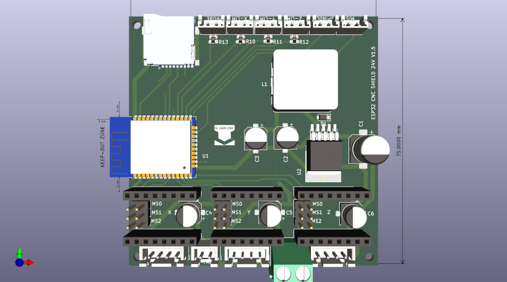
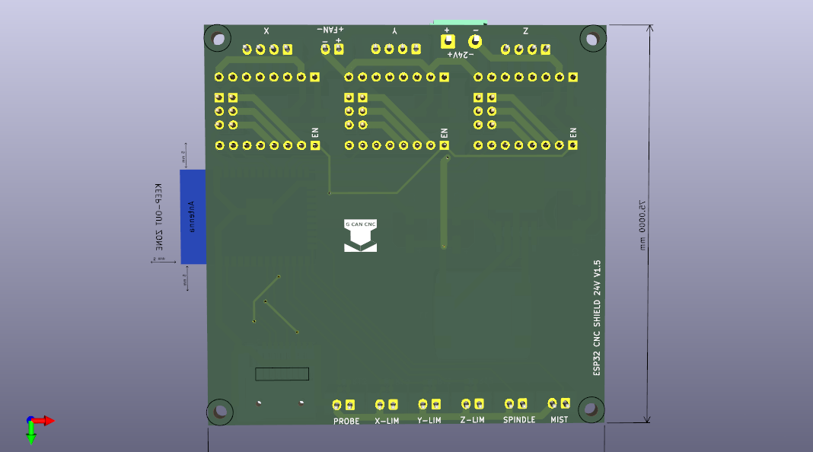

New version of ESP32 CNC SHIELD V1.5

 
  

For this version i made some changes: Included a power supply from 24V to 3.3V.
You have to program the ESP32 before soldering it. I used a small soldering plate and 2 different flux tempratures, 183º for components and 138º for the ESP32 module.
